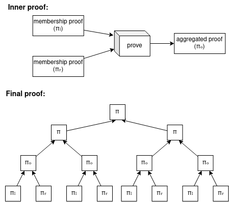

# rovote: recursive ovote 

Recursive-OVOTE: [OVOTE](https://github.com/aragonzkresearch/research/blob/main/ovote/ovote.pdf) enjoying [Plonky2](https://github.com/mir-protocol/plonky2) recursion.

> Note: this repo **is an experiment**, **do not use** in production.

The inner & outer proofs of this repo are based on a modified adaptation from [plony2-semaphore](https://github.com/mir-protocol/plonky2-semaphore).

### Main idea
Voters generate a proof proving their membership in the Census, the votes + proofs are sent offchain to one of the available rollup servers, later the rollup server aggregates the voters proofs into a single proof, which proves the validity of the claimed result for the processed votes from valid voters. This final proof can later be proven in a EVM-friendly proof (eg. Groth16, Plonk+KZG), which is then verified in Ethereum and if valid triggers onchain funds movement.

